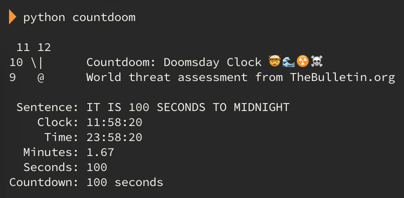

<h1 align="center">
  <a name="top">🤯</a> Countdoom  or; How I Learned to Stop Worrying and Love the Clock 🕚
</h1>

[![GitHub release][badge-release]][link-release]
[![Commits to be deployed][badge-commits]][link-commits]
[![Price][badge-price]][link-repo]
[![Python Package Index][badge-pypi]][link-pypi]
[![Python versions][badge-python]][link-python]
[![Travis CI][badge-travis]][link-travis]
[![Documentation status][badge-docs]][link-docs]
[![CodeCov coverage][badge-codecov]][link-codecov]
[![Code Climate maintainability][badge-codeclimate-maintainability]][link-codeclimate-maintainability]
[![CodeFactor rating][badge-codefactor]][link-codeclimate-maintainability]
[![Code style: black][badge-black]][link-black]
[![License][badge-license]][link-license]
[![All contributors][badge-contributors]][link-contributors]
[![PRs welcome][badge-contribute]][link-contribute]
[![Tweet][badge-twitter]][link-twitter]

Python package to fetch and digest the current [Doomsday Clock]() world
threat assessment from [TheBulletin.org](https://thebulletin.org/).

    
<strong>Be sure to <a href="#" title="star">⭐️</a> or <a href="#" title="fork">🔱</a> this repo if you find it useful! 😃</strong>

    <figure>
        

            
        

    </figure>
    <figcaption>
        
<strong>Countdoom: a Doomsday Clock client.</strong>

    </figcaption>

  - Free software: [MIT license](./LICENSE)
  - Documentation: [Read the Docs](https://countdoom.readthedocs.io/)
  - Source code: [GitHub](https://pypi.org/project/countdoom/)
  - Python package: [PyPI](https://pypi.org/project/countdoom/)

<a href="#top" title="Back to top">🔝</a>

    <a href="#features-">Features</a> |
    <a href="#installation-">Installation</a> |
    <a href="#usage-">Usage</a> |
    <a href="#contributors-">Contributors</a> |
    <a href="#related-projects-">Related projects</a> |
    <a href="#thanks-">Thanks</a>

## Features ✅

  - Fetches the current [Doomsday
    Clock](https://thebulletin.org/doomsday-clock/) value from the
    [Bulletin of the Atomic Scientists](https://thebulletin.org/).
  - Converts the Doomsday Clock sentence into countdown seconds `60`,
    countdown minutes `1`, clock `11:59`, and time `23:59:00`.
  - Offers a command-line interface.
  - Uses async IO.
  - Python 3.5+ compatible.
  - Complete code coverage.

<a href="#top" title="Back to top">🔝</a>

## Installation 💻

**Countdoom** is distributed on the [Python Package Index (PyPI)](https://pypi.org/project/countdoom/). The best way to install it is with
[pip](https://packaging.python.org/tutorials/installing-packages/):

Create a virtual environment (optional):

    virtualenv countdoom-env

Install **Countdoom**:

    pip install countdoom

Run **Countdoom**:

    countdoom

To install from source, please refer to the [online documentation 📘](https://countdoom.readthedocs.io/en/latest/installation.html).

<a href="#top" title="Back to top">🔝</a>

## Usage 🕚

Example usage:

    $ countdoom

     11 12   ️
    10 \|      Countdoom: Doomsday Clock 🤯 🌊 ☢️ ☠️
    9   @      World threat assessment from TheBulletin.org

     Sentence: IT IS 2 MINUTES TO MIDNIGHT
        Clock: 11:58
         Time: 23:58:00
      Minutes: 2
      Seconds: 120
    Countdown: 120 seconds

Example usage using a single format (e.g. clock):

    $ countdoom --format clock

    11:58

Built-in help:

    $ countdoom -h

     11 12   ️
    10 \|      Countdoom: Doomsday Clock 🤯 🌊 ☢️ ☠️
    9   @      World threat assessment from TheBulletin.org

    usage: countdoom [--format {sentence,clock,time,minutes,countdown,all,json}]
                     [--timeout TIMEOUT] [--v] [-h]

    optional arguments:
      --format {sentence,clock,time,countdown,all,json}
                            return data format (default: all).
      --timeout TIMEOUT     connection/request timeout in seconds (default: 10).
      --v, --version        show program's version number and exit
      -h, --help            show this help message and exit

    "Be the change you want to see in the world." —Gandhi/Arleen Lorrance

For programmatic usage, please [refer to the
online documentation 📘](https://countdoom.readthedocs.io/en/latest/usage.html).

<a href="#top" title="Back to top">🔝</a>

## Contributors ✨

<!-- ALL-CONTRIBUTORS-LIST:START - Do not remove or modify this section -->
<!-- prettier-ignore-start -->
<!-- markdownlint-disable -->
<table>
  <tr>
    <td align="center"><a href="https://renemarc.com/"> <b>René-Marc Simard</b></a> <a href="https://github.com/renemarc/countdoom/commits?author=renemarc" title="Code">💻</a> <a href="https://github.com/renemarc/countdoom/commits?author=renemarc" title="Documentation">📖</a> <a href="https://github.com/renemarc/countdoom/commits?author=renemarc" title="Tests">⚠️</a></td>
  </tr>
</table>

<!-- markdownlint-enable -->
<!-- prettier-ignore-end -->
<!-- ALL-CONTRIBUTORS-LIST:END -->

This project follows the [all-contributors](https://allcontributors.org)
specification ([emoji key available here](https://allcontributors.org/docs/en/emoji-key)). Found a bug, want to suggest an idea or share some improvements? [Contributions of any kind are welcome!](./CONTRIBUTING.rst) 😃

<a href="#top" title="Back to top">🔝</a>

## Related projects 👫

  - [Doomsday Clock sensor](https://github.com/renemarc/home-assistant-doomsday-clock): a [Home Assistant](https://www.home-assistant.io/) custom component for the [Community Store](https://hacs.xyz/).

<a href="#top" title="Back to top">🔝</a>

## Thanks 💕

  - The [Bulletin of the Atomic
    Scientists](https://thebulletin.org/doomsday-clock/past-statements/)
    for keeping the world in check since 1947.
  - [Matt Bierner](https://github.com/mattbierner) for the inspiration
    from his
    [MinutesToMidnight](https://github.com/mattbierner/MinutesToMidnight)
    Node.js library.
  - [Cookiecutter](https://github.com/audreyr/cookiecutter) for the
    package creation and
    [audreyr/cookiecutter-pypackage](https://github.com/audreyr/cookiecutter-pypackage) for the project template.

<a href="#top" title="Back to top">🔝</a>

<strong>Don't forget to <a href="#" title="star">⭐️</a> or <a href="#" title="fork">🔱</a> this repo! 😃 Built with <b title="love">❤️</b> in Montréal.</strong>

[badge-black]:https://img.shields.io/badge/code%20style-black-000000.svg?logo=data:image/svg+xml;base64,PD94bWwgdmVyc2lvbj0iMS4wIiBlbmNvZGluZz0iVVRGLTgiPz4KPCFET0NUWVBFIHN2ZyBQVUJMSUMgIi0vL1czQy8vRFREIFNWRyAxLjEvL0VOIiAiaHR0cDovL3d3dy53My5vcmcvR3JhcGhpY3MvU1ZHLzEuMS9EVEQvc3ZnMTEuZHRkIj4KPHN2ZyB4bWxucz0iaHR0cDovL3d3dy53My5vcmcvMjAwMC9zdmciIHhtbG5zOnhsaW5rPSJodHRwOi8vd3d3LnczLm9yZy8xOTk5L3hsaW5rIiB2ZXJzaW9uPSIxLjEiICB3aWR0aD0iMjQiIGhlaWdodD0iMjQiIHZpZXdCb3g9IjAgMCAyNCAyNCI+CiAgIDxwYXRoIGZpbGw9IiNmZmZmZmYiIGQ9Ik0xMiwyQTEwLDEwIDAgMCwxIDIyLDEyQTEwLDEwIDAgMCwxIDEyLDIyQTEwLDEwIDAgMCwxIDIsMTJBMTAsMTAgMCAwLDEgMTIsMk0xNSwxMC41VjlBMiwyIDAgMCwwIDEzLDdIOVYxN0gxM0EyLDIgMCAwLDAgMTUsMTVWMTMuNUMxNSwxMi43IDE0LjMsMTIgMTMuNSwxMkMxNC4zLDEyIDE1LDExLjMgMTUsMTAuNU0xMywxNUgxMVYxM0gxM1YxNU0xMywxMUgxMVY5SDEzVjExWiIgLz4KPC9zdmc+&cacheSeconds=86400

[badge-codeclimate-maintainability]:https://img.shields.io/codeclimate/maintainability/renemarc/countdoom.svg?logo=code-climate&cacheSeconds=300

[badge-codecov]:https://img.shields.io/codecov/c/github/renemarc/countdoom?logo=codecov&logoColor=white&cacheSeconds=300

[badge-codefactor]:https://img.shields.io/codefactor/grade/github/renemarc/countdoom?logo=codefactor&logoColor=white&cacheSeconds=300

[badge-commits]:https://img.shields.io/github/commits-since/renemarc/countdoom/latest.svg?label=commits%20to%20be%20deployed&logo=data:image/svg+xml;base64,PD94bWwgdmVyc2lvbj0iMS4wIiBlbmNvZGluZz0iVVRGLTgiPz4KPCFET0NUWVBFIHN2ZyBQVUJMSUMgIi0vL1czQy8vRFREIFNWRyAxLjEvL0VOIiAiaHR0cDovL3d3dy53My5vcmcvR3JhcGhpY3MvU1ZHLzEuMS9EVEQvc3ZnMTEuZHRkIj4KPHN2ZyB4bWxucz0iaHR0cDovL3d3dy53My5vcmcvMjAwMC9zdmciIHhtbG5zOnhsaW5rPSJodHRwOi8vd3d3LnczLm9yZy8xOTk5L3hsaW5rIiB2ZXJzaW9uPSIxLjEiIHdpZHRoPSIyNCIgaGVpZ2h0PSIyNCIgdmlld0JveD0iMCAwIDI0IDI0Ij4KCTxwYXRoIGZpbGw9IiNmZmZmZmYiIGQ9Ik0xMy41LDhIMTJWMTNMMTYuMjgsMTUuNTRMMTcsMTQuMzNMMTMuNSwxMi4yNVY4TTEzLDNBOSw5IDAgMCwwIDQsMTJIMUw0Ljk2LDE2LjAzTDksMTJINkE3LDcgMCAwLDEgMTMsNUE3LDcgMCAwLDEgMjAsMTJBNyw3IDAgMCwxIDEzLDE5QzExLjA3LDE5IDkuMzIsMTguMjEgOC4wNiwxNi45NEw2LjY0LDE4LjM2QzguMjcsMjAgMTAuNSwyMSAxMywyMUE5LDkgMCAwLDAgMjIsMTJBOSw5IDAgMCwwIDEzLDMiIC8+Cjwvc3ZnPgo=&cacheSeconds=300

[badge-contribute]:https://img.shields.io/badge/pull_requests-welcome-brightgreen.svg?logo=data:image/svg+xml;base64,PD94bWwgdmVyc2lvbj0iMS4wIiBlbmNvZGluZz0iVVRGLTgiPz48IURPQ1RZUEUgc3ZnIFBVQkxJQyAiLS8vVzNDLy9EVEQgU1ZHIDEuMS8vRU4iICJodHRwOi8vd3d3LnczLm9yZy9HcmFwaGljcy9TVkcvMS4xL0RURC9zdmcxMS5kdGQiPjxzdmcgeG1sbnM9Imh0dHA6Ly93d3cudzMub3JnLzIwMDAvc3ZnIiB4bWxuczp4bGluaz0iaHR0cDovL3d3dy53My5vcmcvMTk5OS94bGluayIgdmVyc2lvbj0iMS4xIiB3aWR0aD0iMjQiIGhlaWdodD0iMjQiIHZpZXdCb3g9IjAgMCAyNCAyNCI+PHBhdGggZD0iTTYsM0EzLDMgMCAwLDEgOSw2QzksNy4zMSA4LjE3LDguNDIgNyw4LjgzVjE1LjE3QzguMTcsMTUuNTggOSwxNi42OSA5LDE4QTMsMyAwIDAsMSA2LDIxQTMsMyAwIDAsMSAzLDE4QzMsMTYuNjkgMy44MywxNS41OCA1LDE1LjE3VjguODNDMy44Myw4LjQyIDMsNy4zMSAzLDZBMywzIDAgMCwxIDYsM002LDVBMSwxIDAgMCwwIDUsNkExLDEgMCAwLDAgNiw3QTEsMSAwIDAsMCA3LDZBMSwxIDAgMCwwIDYsNU02LDE3QTEsMSAwIDAsMCA1LDE4QTEsMSAwIDAsMCA2LDE5QTEsMSAwIDAsMCA3LDE4QTEsMSAwIDAsMCA2LDE3TTIxLDE4QTMsMyAwIDAsMSAxOCwyMUEzLDMgMCAwLDEgMTUsMThDMTUsMTYuNjkgMTUuODMsMTUuNTggMTcsMTUuMTdWN0gxNVYxMC4yNUwxMC43NSw2TDE1LDEuNzVWNUgxN0EyLDIgMCAwLDEgMTksN1YxNS4xN0MyMC4xNywxNS41OCAyMSwxNi42OSAyMSwxOE0xOCwxN0ExLDEgMCAwLDAgMTcsMThBMSwxIDAgMCwwIDE4LDE5QTEsMSAwIDAsMCAxOSwxOEExLDEgMCAwLDAgMTgsMTdaIiBmaWxsPSIjZmZmZmZmIiAvPjwvc3ZnPgo=&cacheSeconds=86400

<!-- ALL-CONTRIBUTORS-BADGE:START - Do not remove or modify this section -->

[badge-contributors]:https://img.shields.io/badge/all_contributors-1-orange.svg?logo=github&cacheSeconds=21600
<!-- ALL-CONTRIBUTORS-BADGE:END -->

[badge-docs]:https://img.shields.io/readthedocs/countdoom.svg?logo=read-the-docs&logoColor=White&cacheSeconds=21600

[badge-license]:https://img.shields.io/github/license/renemarc/countdoom.svg?logo=data:image/svg+xml;base64,PD94bWwgdmVyc2lvbj0iMS4wIiBlbmNvZGluZz0iVVRGLTgiPz48IURPQ1RZUEUgc3ZnIFBVQkxJQyAiLS8vVzNDLy9EVEQgU1ZHIDEuMS8vRU4iICJodHRwOi8vd3d3LnczLm9yZy9HcmFwaGljcy9TVkcvMS4xL0RURC9zdmcxMS5kdGQiPjxzdmcgeG1sbnM9Imh0dHA6Ly93d3cudzMub3JnLzIwMDAvc3ZnIiB4bWxuczp4bGluaz0iaHR0cDovL3d3dy53My5vcmcvMTk5OS94bGluayIgdmVyc2lvbj0iMS4xIiB3aWR0aD0iMjQiIGhlaWdodD0iMjQiIHZpZXdCb3g9IjAgMCAyNCAyNCI+PHBhdGggZD0iTTE3LjgsMjBDMTcuNCwyMS4yIDE2LjMsMjIgMTUsMjJINUMzLjMsMjIgMiwyMC43IDIsMTlWMThINUwxNC4yLDE4QzE0LjYsMTkuMiAxNS43LDIwIDE3LDIwSDE3LjhNMTksMkMyMC43LDIgMjIsMy4zIDIyLDVWNkgyMFY1QzIwLDQuNCAxOS42LDQgMTksNEMxOC40LDQgMTgsNC40IDE4LDVWMThIMTdDMTYuNCwxOCAxNiwxNy42IDE2LDE3VjE2SDVWNUM1LDMuMyA2LjMsMiA4LDJIMTlNOCw2VjhIMTVWNkg4TTgsMTBWMTJIMTRWMTBIOFoiIGZpbGw9IiNmZmZmZmYiIC8+PC9zdmc+Cg==&cacheSeconds=86400

[badge-price]:https://img.shields.io/badge/FREE_as_in-SPEECH-success.svg?logo=data:image/svg+xml;base64,PD94bWwgdmVyc2lvbj0iMS4wIiBlbmNvZGluZz0iVVRGLTgiPz4KPCFET0NUWVBFIHN2ZyBQVUJMSUMgIi0vL1czQy8vRFREIFNWRyAxLjEvL0VOIiAiaHR0cDovL3d3dy53My5vcmcvR3JhcGhpY3MvU1ZHLzEuMS9EVEQvc3ZnMTEuZHRkIj4KPHN2ZyB4bWxucz0iaHR0cDovL3d3dy53My5vcmcvMjAwMC9zdmciIHhtbG5zOnhsaW5rPSJodHRwOi8vd3d3LnczLm9yZy8xOTk5L3hsaW5rIiB2ZXJzaW9uPSIxLjEiICB3aWR0aD0iMjQiIGhlaWdodD0iMjQiIHZpZXdCb3g9IjAgMCAyNCAyNCI+CiAgIDxwYXRoIGZpbGw9IiNmZmZmZmYiIGQ9Ik0xNS40MSwyMkMxNS4zNSwyMiAxNS4yOCwyMiAxNS4yMiwyMkMxNS4xLDIxLjk1IDE1LDIxLjg1IDE0Ljk2LDIxLjczTDEyLjc0LDE1LjkzQzEyLjY1LDE1LjY5IDEyLjc3LDE1LjQyIDEzLDE1LjMyQzEzLjcxLDE1LjA2IDE0LjI4LDE0LjUgMTQuNTgsMTMuODNDMTUuMjIsMTIuNCAxNC41OCwxMC43MyAxMy4xNSwxMC4wOUMxMS43Miw5LjQ1IDEwLjA1LDEwLjA5IDkuNDEsMTEuNUM5LjExLDEyLjIxIDkuMDksMTMgOS4zNiwxMy42OUM5LjY2LDE0LjQzIDEwLjI1LDE1IDExLDE1LjI4QzExLjI0LDE1LjM3IDExLjM3LDE1LjY0IDExLjI4LDE1Ljg5TDksMjEuNjlDOC45NiwyMS44MSA4Ljg3LDIxLjkxIDguNzUsMjEuOTZDOC42MywyMiA4LjUsMjIgOC4zOSwyMS45NkMzLjI0LDE5Ljk3IDAuNjcsMTQuMTggMi42Niw5LjAzQzQuNjUsMy44OCAxMC40NCwxLjMxIDE1LjU5LDMuM0MxOC4wNiw0LjI2IDIwLjA1LDYuMTUgMjEuMTMsOC41N0MyMi4yMiwxMSAyMi4yOSwxMy43NSAyMS4zMywxNi4yMkMyMC4zMiwxOC44OCAxOC4yMywyMSAxNS41OCwyMkMxNS41LDIyIDE1LjQ3LDIyIDE1LjQxLDIyTTEyLDMuNTlDNy4wMywzLjQ2IDIuOSw3LjM5IDIuNzcsMTIuMzZDMi42OCwxNi4wOCA0Ljg4LDE5LjQ3IDguMzIsMjAuOUwxMC4yMSwxNkM4LjM4LDE1IDcuNjksMTIuNzIgOC42OCwxMC44OUM5LjY3LDkuMDYgMTEuOTYsOC4zOCAxMy43OSw5LjM2QzE1LjYyLDEwLjM1IDE2LjMxLDEyLjY0IDE1LjMyLDE0LjQ3QzE0Ljk3LDE1LjEyIDE0LjQ0LDE1LjY1IDEzLjc5LDE2TDE1LjY4LDIwLjkzQzE3Ljg2LDE5Ljk1IDE5LjU3LDE4LjE2IDIwLjQ0LDE1LjkzQzIyLjI4LDExLjMxIDIwLjA0LDYuMDggMTUuNDIsNC4yM0MxNC4zMywzLjggMTMuMTcsMy41OCAxMiwzLjU5WiIgLz4KPC9zdmc+&cacheSeconds=86400

[badge-pypi]:https://img.shields.io/pypi/v/countdoom.svg?logo=data:image/svg+xml;base64,PD94bWwgdmVyc2lvbj0iMS4wIiBlbmNvZGluZz0iVVRGLTgiPz4KPCFET0NUWVBFIHN2ZyBQVUJMSUMgIi0vL1czQy8vRFREIFNWRyAxLjEvL0VOIiAiaHR0cDovL3d3dy53My5vcmcvR3JhcGhpY3MvU1ZHLzEuMS9EVEQvc3ZnMTEuZHRkIj4KPHN2ZyB4bWxucz0iaHR0cDovL3d3dy53My5vcmcvMjAwMC9zdmciIHhtbG5zOnhsaW5rPSJodHRwOi8vd3d3LnczLm9yZy8xOTk5L3hsaW5rIiB2ZXJzaW9uPSIxLjEiICB3aWR0aD0iMjQiIGhlaWdodD0iMjQiIHZpZXdCb3g9IjAgMCAyNCAyNCI+CiAgIDxwYXRoIGZpbGw9IiNmZmZmZmYiIGQ9Ik0yMSwxNi41QzIxLDE2Ljg4IDIwLjc5LDE3LjIxIDIwLjQ3LDE3LjM4TDEyLjU3LDIxLjgyQzEyLjQxLDIxLjk0IDEyLjIxLDIyIDEyLDIyQzExLjc5LDIyIDExLjU5LDIxLjk0IDExLjQzLDIxLjgyTDMuNTMsMTcuMzhDMy4yMSwxNy4yMSAzLDE2Ljg4IDMsMTYuNVY3LjVDMyw3LjEyIDMuMjEsNi43OSAzLjUzLDYuNjJMMTEuNDMsMi4xOEMxMS41OSwyLjA2IDExLjc5LDIgMTIsMkMxMi4yMSwyIDEyLjQxLDIuMDYgMTIuNTcsMi4xOEwyMC40Nyw2LjYyQzIwLjc5LDYuNzkgMjEsNy4xMiAyMSw3LjVWMTYuNU0xMiw0LjE1TDYuMDQsNy41TDEyLDEwLjg1TDE3Ljk2LDcuNUwxMiw0LjE1TTUsMTUuOTFMMTEsMTkuMjlWMTIuNThMNSw5LjIxVjE1LjkxTTE5LDE1LjkxVjkuMjFMMTMsMTIuNThWMTkuMjlMMTksMTUuOTFaIiAvPgo8L3N2Zz4=&cacheSeconds=86400

[badge-python]:https://img.shields.io/pypi/pyversions/countdoom.svg?logo=python&logoColor=White&cacheSeconds=21600

[badge-release]:https://img.shields.io/github/release/renemarc/countdoom/all.svg?logo=git&logoColor=white&cacheSeconds=21600

[badge-travis]:https://img.shields.io/travis/com/renemarc/countdoom.svg?logo=travis-ci&logoColor=White

[badge-twitter]:https://img.shields.io/twitter/url/https/github.com/renemarc/countdoom.svg?style=social&cacheSeconds=86400

[badge-updates]:https://pyup.io/repos/github/renemarc/countdoom/shield.svg

[link-black]:https://black.readthedocs.io/
[link-codeclimate-maintainability]:https://codeclimate.com/github/renemarc/countdoom
[link-codecov]:https://codecov.io/gh/renemarc/countdoom
[link-codefactor]:https://www.codefactor.io/repository/github/renemarc/countdoom
[link-commits]:https://github.com/renemarc/countdoom/compare/v0.1.0...master
[link-contribute]:./CONTRIBUTING.rst
[link-contributors]:#contributors-
[link-docs]:https://countdoom.readthedocs.io/
[link-license]:./LICENSE
[link-pypi]:https://pypi.org/project/countdoom/
[link-python]:https://pypi.python.org/pypi/countdoom/
[link-release]:./releases/latest
[link-repo]:https://github.com/renemarc/countdoom/
[link-travis]:https://travis-ci.com/renemarc/countdoom
[link-twitter]:https://twitter.com/intent/tweet?text=Countdoom%3A%20a%20%23DoomsdayClock%20client%20package%20for%20%23Python%21&via=renemarc&hashtags=Doomsday,BulletinAtomic
[link-updates]:https://pyup.io/repos/github/renemarc/countdoom/
